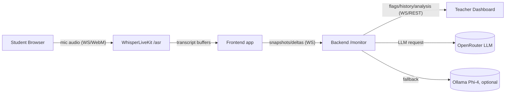

# Classroom Monitor
Live classroom monitoring with WhisperLiveKit (ASR+diarization), a FastAPI moderation/analysis backend, and a React/Vite teacher dashboard.

## Quick Start (running the code)
1) **Requirements**: Docker + Docker Compose, internet to pull images/models.
2) **Env**: `cp .env.example .env` then fill:
   - `OPENROUTER_API_KEY` (or put the key in `openrouterkey`).
   - Keep `ANALYSIS_PROVIDER=openrouter` (default) or set `local` if you only want Ollama/Phi-4.
   - `ENABLE_LOCAL_LLM_FALLBACK=1` if you want local Phi-4 as backup; otherwise `0` and remove/comment `phi4`/`phi4-init` in compose.
3) **Hugging Face token (diart/pyannote)**:
   - Accept the `pyannote/segmentation-3.0` license on Hugging Face, create a token.
   - Save it (single line) to `./WhisperLiveKit/hf_token_temp`. The WhisperLiveKit Dockerfile copies it into the image.
4) **Build & run**:
   ```bash
   docker compose up --build
   ```
5) **Open**:
   - Student view: http://localhost:5173/
   - Teacher dashboard: http://localhost:5173/teacher

## Product Note (concise)
- **Framing**: Real-time classroom transcribe/diarize speech, flag profanity or language drift, and surface insights for teachers.
- **MVP does**: Low-latency ASR with diarization, profanity + language-mismatch alerts, periodic snapshots sent to backend, LLM-generated 30s analysis, teacher dashboard with history/flags.
- **MVP doesn’t**: Auth/roles, durable storage, speaker enrollment, multi-group support.
## Technical Note (concise)

- **Audio streaming**: Browser MediaRecorder sends WebM chunks over WS to WhisperLiveKit `/asr`; server emits diarized/transcribed/translated buffers; frontend merges buffers into stable lines.
- **APIs/models (why)**: WhisperLiveKit with diart (pyannote) for reliable diarization; OpenRouter (gpt-4o-mini default) for robust, low-latency analysis; optional local Phi-4 via Ollama to keep working when offline or to cut cost.
- **Alerts (high level)**: Frontend sends deltas/snapshots to backend; backend flags profanity via `better_profanity` and language mismatches against `allowed_language`; each snapshot triggers an LLM call to produce the 30s teacher-facing report.
- **Limitations / improvements**: In-memory state only; no auth/rate limits; OpenRouter dependency when online; diarization quality depends on HF token/model; no GPU path. For production: add persistence, auth, metrics/alerts, retries/backpressure, GPU builds, and configurable model choices.

## Services (docker-compose)
- `whisperlivekit`: ASR + diarization (diart, pyannote).
- `backend`: FastAPI websocket/REST moderation + LLM analysis.
- `frontend`: React/Vite served by Nginx.
- `phi4`/`phi4-init` (optional): Ollama Phi-4 fallback.

## Endpoints
- Student view: `http://localhost:5173/` (WS to `ws://localhost:8100/asr`)
- Teacher dashboard: `http://localhost:5173/teacher`
- Backend WS: `ws://localhost:8000/monitor` (receives `type: "snapshot"`; broadcasts flags + `type: "analysis"`)
- Backend REST: `GET /complete-conversation` → `{history, meta, analysis}`, `GET /flagged` → `{flagged, meta}`, `GET /analysis` → `{analysis, meta}`

## Health Checks
- OpenRouter:
  ```bash
  curl https://openrouter.ai/api/v1/chat/completions \
    -H "Content-Type: application/json" \
    -H "Authorization: Bearer <YOUR_OPENROUTER_API_KEY>" \
    -H "HTTP-Referer: http://localhost" \
    -H "X-Title: ClassroomMonitor" \
    -d '{"model":"openai/gpt-4o-mini","messages":[{"role":"user","content":"Ping from Classroom Monitor. Reply OK."}],"max_tokens":32}'
  ```
- Local Phi-4:
  ```bash
  curl http://localhost:11434/v1/chat/completions \
    -H "Content-Type: application/json" \
    -H "Authorization: Bearer ollama" \
    -d '{"model":"phi4","messages":[{"role":"user","content":"Ping from Classroom Monitor. Reply OK."}],"max_tokens":32}'
  ```
